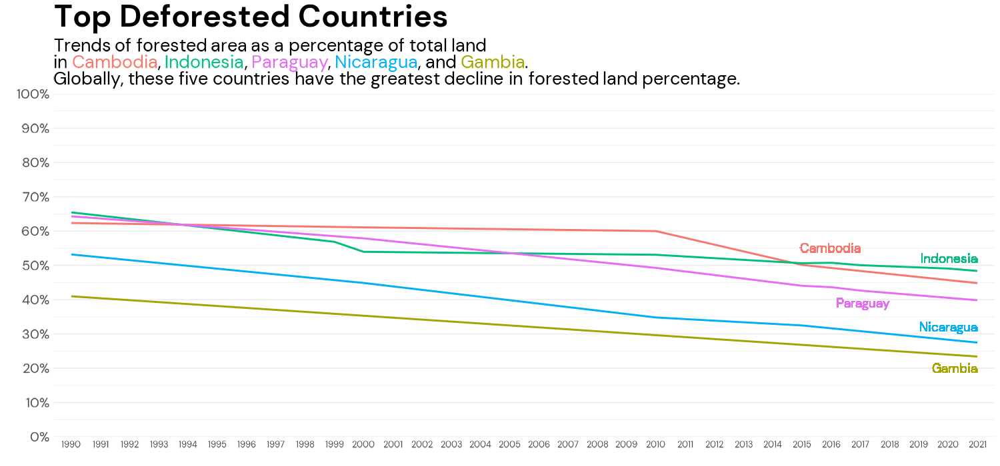
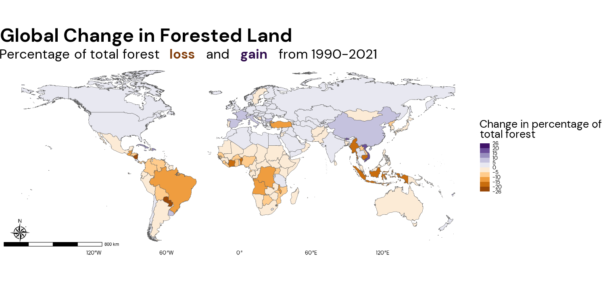

# SD5813 Advanced Data Visualisation Portfolio
## Visualisation 1: Time Series Line Chart

A line chart representing the change in percentage of forest area from 1990 to 2021. Cambodia, Indonesia, Paraguay, Nicaragua and Gambia are highlighted as they are the top five most deforested countries in the world, as measured by percent change in forest. Forest data used to create this line chart is sourced from the [World Bank Group](https://databank.worldbank.org/source/environment-social-and-governance-(esg)-data#) 
## Visualisation 2: Choropleth Map

Spatial representation of the change in total forest percentage by country from 1990 to 2021, with forest loss depicted on a diverging scale from orange to purple representing forest loss and gain respectively. This map portrays a general view of which countries have increasing and decreasing trends overtime. The Spatial polygon data used to create the map is sourced from [Opendatasoft](https://public.opendatasoft.com/explore/dataset/world-administrative-boundaries/table/?sort=name&dataChart=eyJxdWVyaWVzIjpbeyJjb25maWciOnsiZGF0YXNldCI6IndvcmxkLWFkbWluaXN0cmF0aXZlLWJvdW5kYXJpZXMiLCJvcHRpb25zIjp7InJlZmluZS5zdGF0dXMiOiJNZW1iZXIrU3RhdGUiLCJzb3J0IjoibmFtZSIsImxvY2F0aW9uIjoiMywzOC43NjE1OCwzMy43NSIsImJhc2VtYXAiOiJqYXdnLmxpZ2h0In19LCJjaGFydHMiOlt7ImFsaWduTW9udGgiOnRydWUsInR5cGUiOiJjb2x1bW4iLCJmdW5jIjoiQ09VTlQiLCJzY2llbnRpZmljRGlzcGxheSI6dHJ1ZSwiY29sb3IiOiIjRkY1MTVBIn1dLCJ4QXhpcyI6InN0YXR1cyIsIm1heHBvaW50cyI6NTAsInNvcnQiOiIifV0sInRpbWVzY2FsZSI6IiIsImRpc3BsYXlMZWdlbmQiOnRydWUsImFsaWduTW9udGgiOnRydWV9&location=3,38.76158,33.75&basemap=jawg.light)